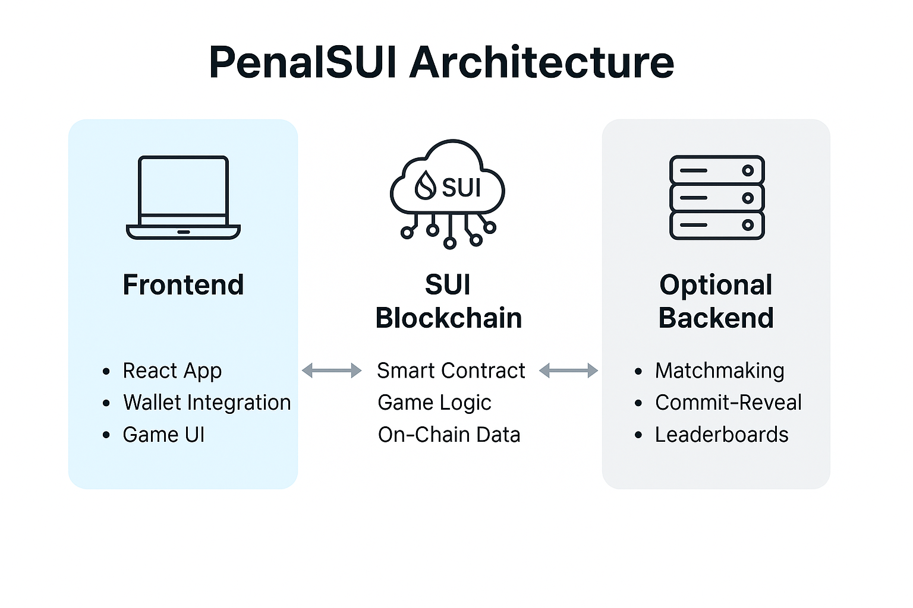

## ⚽ PenalSUI — App Overview

### 🎯 Purpose

**PenalSUI** is a real-time, player-versus-player (PVP) penalty shootout game built on the **SUI blockchain**, designed to deliver **trustless, verifiable, and competitive gameplay** where each match is recorded and governed by smart contracts.

Players compete in a turn-based penalty shootout where strategic guessing and shooting directions determine the winner — all while earning rewards or reputation on-chain.

---

### 🧩 Core Features

| Feature                         | Description                                                                 |
| ------------------------------- | --------------------------------------------------------------------------- |
| **Real-Time PVP**               | Two players compete in a 5-round penalty shootout.                          |
| **Turn-Based Logic**            | Alternate roles (Shooter / Keeper) in each round.                           |
| **On-Chain Game Engine**        | Game logic fully governed by SUI smart contracts (Move language).           |
| **Match Recording**             | All game results are stored on-chain for transparency and auditability.     |
| **Commit-Reveal Option**        | (Optional) Prevents front-running or cheating during move submissions.      |
| **Rewards & Stakes**            | Future integration with SUI token staking, NFTs, or leaderboard incentives. |
| **Fair Matchmaking**            | Players can auto-match or invite opponents.                                 |
| **Frontend Wallet Integration** | Connect SUI-compatible wallets for authentication and transaction signing.  |

---

### 🕹️ Game Mechanics

#### Match Rules:

- Best of **5 rounds**.
- Each round:

  - Shooter picks a direction (Left, Center, Right).
  - Keeper guesses direction.
  - If guess ≠ shoot → **GOAL**

- Roles alternate each round (Player1 shoots odd rounds, Player2 even rounds).

#### Flow:

1. **Player A** creates game lobby.
2. **Player B** joins.
3. Match begins — on-chain state tracks each round.
4. Players submit choices (shoot or guess) via transactions.
5. Smart contract computes score.
6. After 5 rounds → winner declared.

---

### 🏗️ App Architecture

#### 💾 On-Chain (SUI):

- Smart contract module in **Move**.
- Stores:

  - Game state
  - Player addresses
  - Moves & guesses
  - Score & round data
  - Final result

- Implements:

  - Game creation / joining
  - Turn validation
  - Score calculation

#### 🖥️ Frontend (React):

- Connect to SUI wallet (e.g., Sui Wallet / Surf Wallet).
- Real-time UI updates via polling or events.
- Smooth user flow: create, join, play, see results.
- Basic UI states: Lobby → Match → Result

---

### 🔒 Security & Fairness

| Aspect                | Strategy                                                         |
| --------------------- | ---------------------------------------------------------------- |
| **Move Integrity**    | All logic enforced on-chain, no hidden computation.              |
| **Commit-Reveal**     | Hashing moves before reveal (optional) to prevent front-running. |
| **Signature Checks**  | Each action tied to wallet signatures — tamper-resistant.        |
| **Immutable Records** | Final game result is permanent and verifiable on-chain.          |

---

### 🧑‍🎨 UX Design Notes

- 🎮 Arcade style UI with countdown timer per move.
- ⚔️ PVP match history view.
- 🏆 Rank display and badges based on win streak.
- 💼 Profile page with wallet-linked stats and NFTs.

---

### 📈 Roadmap

| Phase    | Goals                                                              |
| -------- | ------------------------------------------------------------------ |
| **MVP**  | On-chain game engine, wallet integration, basic game UI            |
| **v1.0** | Commit-reveal, profile stats, basic leaderboard                    |
| **v1.5** | NFT player badges, reputation tracking, enhanced matchmaking       |
| **v2.0** | Token staking, live tournaments, AI player support, mobile version |

---
